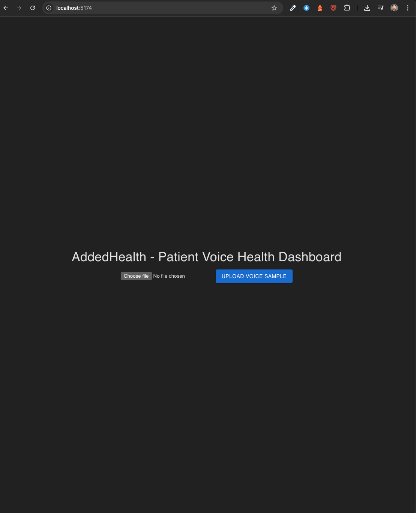

# voice Reading System

## Endpoints


- `POST /patients/{id}/voice-samples` - Upload voice recording (form file field `file`). Accepts WAV files for analysis; other types are stored but only basic metadata will be available.
- `GET /patients/{id}/analysis` - Get latest analysis results for a patient.
- `GET /patients/{id}/history` - Get historical trends / list of past analyses.
- `POST /alerts/configure` - Configure alert thresholds.


## Run locally without Docker

### Setup virtual environment
    - Run `python3 -m venv venv`
    - Run `source venv/bin/activate`

#### frontend
-   Run `cd frontend`
-   Run `npm install`
-   Run `npm run start`
If everything goes well, http://localhost:5174/



#### frontend
-   Run `cd backend`
-   Run `python3 -m pip install -r requirements.txt`
-   Run `npm run start`
-   Run `uvicorn app.main:app --reload --host 0.0.0.0 --port 8000`

If everythin is successfull, Open http://localhost:8000/docs → your API should still work.
 
## Run locally with Docker

-   Run with docker-compose: `docker-compose up --build`


## Example `curl` requests

Upload (WAV):
```bash
curl -X POST "http://localhost:8000/patients/123/voice-samples" -F "file=@/path/to/sample.wav"


